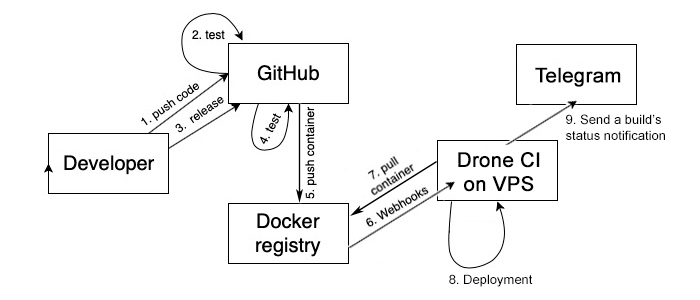

# Telegram channels' posts aggregator

🚧 ...Work in progress... 🚧

📩 📭 Aggregates posts from your telegram channel(s) assigned to your bot(s), filters the data, saves it into MongoDB & renders the data using React (see the **client** folder).

# Features & Technologies 💡

- [telegraf.js](https://telegraf.js.org/#/?id=features)
- [cheerio](https://www.npmjs.com/package/cheerio)
- [sync-request](https://www.npmjs.com/package/sync-request) but consider [then-request](https://github.com/then/then-request)
- [normalize-url](https://www.npmjs.com/package/normalize-url)
- @multifeed_edge_bot to aggregate and [redirect](https://github.com/galakhov/tg-channelposts-aggregator/tree/master/server) messages from a set of channels
- [ElasticSearch](https://www.elastic.co)
- [monstache](https://rwynn.github.io/monstache-site/)
- Docker Hub Registry
- Drone CI

# Installation

See [server/README.md](server/README.md) & [client/README.md](client/README.md) files for the detailed installation steps.

# The big picture of CI/CD

<center></center>
<sub><strong>Figure 1. CI/CD step-by-step.</strong></sub>

## The Set-Up

My set-up is the healthy combination of the docker files, [automated builds](https://docs.docker.com/docker-hub/builds/) in the Docker Registry and the self-hosted Drone CI platform. The set-up is similar to the one in this [post](https://habr.com/ru/post/476368/), which describes CI/CD pipeline built on the GitHub Actions with the execution of some bash scripts via SSH on a VPS.

Again, I'm using Docker Hub's automated builds instead of the step 5 (named as 'build_and_pub' in this post), which is shown in the figure 1. [Drone CI](https://docs.drone.io) is responsible for the deployment of the Docker Swarm services on the VPS of your choice instead of the console scripts, which are hard-coded in the GitHub Actions as a custom webhook (curl POST request to a endpoint in the 'deploy' step):

```bash
docker stack deploy -c /path/to/docker-compose-stack-file.yml <stack-name>
```

To avoid any mis-configuration, it's recommended to check up the GitHub's Webhooks (https://github.com/<github-user>/<github-repo>/settings/hooks) after the set-up of the automated build(s) in the Docker Account (https://hub.docker.com/repository/docker/<organisation-name>/<repo-name>/builds/edit).

## Posts with similar set-ups:

- [Setup Gitea and Drone on Docker 2020 Edition](https://blog.ruanbekker.com/blog/2020/02/04/setup-gitea-and-drone-on-docker-2020-edition/) / [Source code 1](https://gist.github.com/ruanbekker/27d2cb2e3f4194ee5cfe2bcdc9c4bf52) / [Source code 2](https://gist.github.com/ruanbekker/3847bbf1b961efc568b93ccbf5c6f9f6)
- [Using Drone CI to Build a Jekyll Site and Deploy to Docker Swarm](https://blog.ruanbekker.com/blog/2019/04/23/using-drone-ci-to-build-a-jekyll-site-and-deploy-to-docker-swarm/)
- [Setup a Drone CICD Environment on Docker With Letsencrypt](https://blog.ruanbekker.com/blog/2019/04/18/setup-a-drone-cicd-environment-on-docker-with-letsencrypt/)
- [Self Hosted Git and CICD Platform with Gitea and Drone on Docker](https://sysadmins.co.za/self-hosted-git-and-cicd-platform-with-gitea-and-drone-on-docker/)

### Posts on Docker Swarm Clusters

[Create a Docker Swarm Cluster on DigitalOcean](https://lunar.computer/posts/docker-swarm-digitalocean/)

### Posts on Traefik v2

[Traefik v2 with the static and dynamic configuration](https://dev.to/nflamel/how-to-have-https-on-development-with-docker-traefik-v2-and-mkcert-2jh3)

### Posts on and insights to Drone CI

#### Docker Hub Webhooks

The **step 6** is all about Docker Hub Webhooks that by default are ["(...) POST requests sent to a URL you define in Docker Hub."](https://docs.docker.com/docker-hub/webhooks/).

To trigger the _deploy_ step in the self-hosted Drone CI platform after the containers were built, you need to set up the webhook in the Docker Hub in one of your repositories, preferably in the repository that's being built last of all:

```bash
https://hub.docker.com/repository/docker/<organisation-name>/<repo-name>/webhooks
```

The Webhook name is not important, but the Webhook URL is crucial and is explained in detail in the next section.

#### What Webhook URLs are allowed by the Drone CI's API?

To process an external call we use the built-in [Drone CI's REST API endpoint](https://docs.drone.io/api/overview/), which receives GET, POST, DELETE and other external requests.

Accessing this endpoint, you can, for instance, view the list of the recent deployments (the deployments in the Drone CI platform are called _builds_) in your repository by sending the following **GET** request using _curl_ or just by opening this page in your browser:

```bash
http://YOUR_IP_OR_DNS:PORT/api/repos/{github-owner}/{repo}/builds
```

However, we need to trigger our pipeline and start a new _build_, which will then pull all the required newly built containers from Docker Hub. To run the [pipeline](./.drone.yml) and the deploy step in particular, a build needs to be [invoked](https://docs.drone.io/api/builds/build_create/) with the `custom` [event type](https://docs.drone.io/pipeline/triggers/#by-event). A new build with the corresponding pipeline commands will then be started after the webhook in form of the **POST** request is received:

```bash
POST http://YOUR_IP_OR_DNS:PORT/api/repos/{github-owner}/{repo-name}/builds?branch={branch-in-the-repo-with-the-drone-yml-pipeline-file}
```

It would have been enough if the API endpoint were public. The part on how to accomplish an authorized POST request without curl and the part about _/builds_ parameters are so far (March, 2020) quite badly documented. By the way, the personal bearer authorization token generated by Drone CI itself can be found in the account settings: http://YOUR_IP_OR_DNS:PORT/account.

In the Docker Hub there is, however, no way to send POST requests like you would do it on [reqbin.com](https://reqbin.com) with an option to choose the type of authorization, etc. So how does the Webhook URL should look like to be the correct request for the Drone CI endpoint?

It turns out, you can send an authorized POST request by passing over the **?access_token=** parameter that, among [other parameters](https://github.com/drone/drone/issues/2679), is being [verified during the creation of a build](https://github.com/drone/drone/blob/3fcbf1c78f44c4b592d17b009982578215994bd1/handler/api/repos/builds/create.go#L91). The final _Webhook URL_, triggering a new build, is then looks like this:

```bash
http://YOUR_IP_OR_DNS:PORT/api/repos/{github-owner}/{repo-name}/builds?branch={branch-in-the-repo-with-the-drone-yml-pipeline-file}&access_token=<authorization-token>
```

### Other Drone CI sources

Sample of a [.drone.yml configuration](https://gist.github.com/anson-vandoren/03234a231e9af533aa0bad9ff2d2b58f) file.

Docs of the Drone [plugin that executes commands on a remote server via SSH](http://plugins.drone.io/appleboy/drone-ssh/) / [Drone SSH on GitHub](https://github.com/appleboy/drone-ssh):

- [How to set environment variables for a drone plugin](https://github.com/appleboy/drone-ssh/issues/130)
- [Undocumented Drone SSH environment variables](https://github.com/appleboy/drone-ssh/blob/master/main.go)
- [Drone SSH: usage example](https://git.b12f.io/hornet.garden/hornet.garden/src/commit/afe6557279ddc9b53c2be882797bae36ea185d08/.drone.yml?lang=lv-LV)

[The Drone Telegram Plugin](http://plugins.drone.io/appleboy/drone-telegram/) to send notifications about the build status to a chat in Telegram:

- [Get the token by creating and starting your bot](https://angristan.xyz/2018/08/setup-telegram-bot-for-drone-ci-cd-builds/)
- Chat ID for the 'to' parameter can be obtained by starting the @userinfobot or @get_id_bot in Telegram.

# Credits 🙏

Inspired by and based on this [repo](https://github.com/foreseaz/tg-channel-dashboard).
