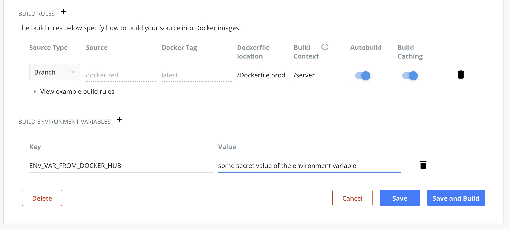

# Telegram channels' posts aggregator

🚧 ...Work in progress... 🚧

📩 📭 Aggregates posts from your telegram channel(s) assigned to your bot(s), filters the data, saves it into MongoDB & renders the data using React (see the **client** folder).

# Features & Technologies 💡

- [telegraf.js](https://telegraf.js.org/#/?id=features)
- [cheerio](https://www.npmjs.com/package/cheerio)
- [sync-request](https://www.npmjs.com/package/sync-request) but consider [then-request](https://github.com/then/then-request)
- [normalize-url](https://www.npmjs.com/package/normalize-url)
- @multifeed_edge_bot to aggregate and [redirect](https://github.com/galakhov/tg-channelposts-aggregator/tree/master/server) messages from a set of channels
- [ElasticSearch](https://www.elastic.co)
- [monstache](https://rwynn.github.io/monstache-site/)
- [Docker Hub Registry](https://hub.docker.com)
- [Traefik](https://docs.traefik.io/)
- [Self-hosted Drone.io: CI/CD Tool](https://drone.io)
- [Telegram](https://core.telegram.org/bots/api)

# Installation

See [server/README.md](server/README.md) & [client/README.md](client/README.md) files for the detailed installation steps.

# The big picture of CI/CD


<sub><strong>Figure 1. CI/CD step-by-step.</strong></sub>

## The setup of Continuous Deployment and prerequisites

My set-up is a healthy combination of the containers arranged into a [Docker Swarm Stack](https://docs.docker.com/engine/swarm/), the Docker Hub Registry's with [automated builds](https://docs.docker.com/docker-hub/builds/), [Traefik (v2)](https://docs.traefik.io) and the self-hosted lightweight container-native CI/CD platform called [Drone.io](https://drone.io) with couple of [plugins](http://plugins.drone.io).

### Docker Hub's Automated Builds vs GitHub Actions

The set-up is somewhat similar to the one presented in this [post](https://habr.com/ru/post/476368/), The post outlines a CI/CD pipeline entirely based on [GitHub Actions](https://github.com/features/actions) and on some bash scripts, executed via SSH on a VPS. Besides the redundant configuration of the Docker Hub's secrets and the recurring logins to Docker Hub, author [hard-codes](https://github.com/dementevda/actions_ci_example/blob/master/.github/workflows/pub_on_release.yaml) a deployment webhook in the `deploy` step of the pipeline, i.e. a _curl_ POST request to his own custom endpoint. His solution is a bit over-engineered, though, it allows to control things manually, and useful if you plan to stick to GitHub Actions.

If you connect your Docker Hub account with a GitHub repository you actually don't need to configure any additional secrets in GitHub, nor use any GitHub Actions or any commands to build & push your containers (**step 5** in the _Figure 1_). With a pre-configured _automated build_ for each stack (or even for each microservice, coming from another repository), Docker Hub Registry (re-)builds and (re-)places the required containers by itself, provided there was a push event (**step 1**).

> An automated build avoids the manual work of building, tagging and pushing Docker images. It also makes it easier to keep the code in your images in sync with the code in your version control system. Lastly there are some important security benefits if you rebuild your images regularly to incorporate security updates.
> Source: [Why use an automated build?](https://medium.com/microscaling-systems/labelling-automated-builds-on-docker-hub-f3d073fb8e1#18e1)

For instance, I have two containers in the current GitHub repository with the corresponding Dockerfiles for the frontend and for the backend: `./client/Dockerfile.prod` and `./server/Dockerfile.prod`. The example configuration of the frontend's container is shown in the image below:


<sub><strong>Figure 2. Automated docker build: frontend container's configuration.</strong></sub>

<br />
<br />
These two containers are (re-)built and saved in the Docker Hub Registry every time I push new changes to the repository, these microservices were pushed to.
<br />
<br />

> To avoid any mis-configuration, it's recommended to verify the GitHub's Webhooks (https://github.com/{github-user}/{github-repo}/settings/hooks), which are being added by Docker Hub, after the set-up of the automated build(s) in the Docker Account: https://hub.docker.com/repository/docker/{organisation-name}/{repo-name}/builds/edit.

_Automated builds_ allow you to go even more deeper. For instance, if you need to build a container with some custom parameters, i.e. pass additional arguments or environment variables, you can [override](https://docs.docker.com/docker-hub/builds/advanced/#override-build-test-or-push-commands) the `docker build` command by setting up the [custom build phase hooks](https://docs.docker.com/docker-hub/builds/advanced/#custom-build-phase-hooks). The `docker build` command would then look like this one:

```bash
docker build -t $IMAGE_NAME -f $DOCKERFILE_PATH --build-arg CUSTOM_ENV_VAR=$ENV_VAR_FROM_DOCKER_HUB .
```

If you **save** the `ENV_VAR_FROM_DOCKER_HUB` environment variable in the Automated Build's settings (_Build configurations_ in Figure 2), you will then be able to access it as an argument later as explaned below:


<sub><strong>Figure 3. Set up of environment variables in Automated Build's settings.</strong></sub>

<br />
<br />

As a result, the `CUSTOM_ENV_VAR` will be available and can then be accessed during the build phase like so:

```bash
# see the complete example in: ./client/Dockerfile.prod
FROM mhart/alpine-node:10 as machine-1
ARG CUSTOM_ENV_VAR
ENV CUSTOM_ENV $CUSTOM_ENV_VAR
RUN PASS_THIS_ENV_VAR_TO_SCRIPT=${CUSTOM_ENV} node scripts/script.js
# you can get the env variable passed to scripts/script.js using: process.env.PASS_THIS_ENV_VAR_TO_SCRIPT
# see: ./client/src/utils/constants/index.js
RUN echo $CUSTOM_ENV_VAR > /files/in/the/path/file_with_a_custom_var
# (...)
# and then in another build phase of you Dockerfile:
COPY --from=machine-1 /files/in/the/path /copied/here/in/another/path
RUN cat /copied/here/in/another/path/file_with_a_custom_var
```

By the way, you need to [prepend](https://create-react-app.dev/docs/adding-custom-environment-variables) the `REACT_APP_` prefix to your environment variables if you are trying to compile a react application during the build phase and want to pass any ENV vars into it:

```bash
# (...) so the line with an environment variable becomes:
RUN REACT_APP_ENV_VAR=${CUSTOM_ENV} node scripts/build.js --env.NODE_ENV=production
# (...)
# you can then read the env variable in any script using: process.env.REACT_APP_ENV_VAR
```

Of course you can set up **multiple** environment variables ([like in this example](https://github.com/rossf7/label-schema-automated-build/blob/master/hooks/build)) using the `--build-arg` flag:

```bash
docker build --build-arg <varname1>=<value1> --build-arg <varname2>=<value2> -t $IMAGE_NAME  -f $DOCKERFILE_PATH .
```

In case you wonder what these `$IMAGE_NAME` and `$DOCKERFILE_PATH` are? Those are the default utility environment variables and ["are available during automated builds"](https://docs.docker.com/docker-hub/builds/advanced/#environment-variables-for-building-and-testing). The flags `-t` and `-f` with these variables should be left as they are in order to correctly rerun (i.e., _override_) the `docker build` command with the same build configuration, as it was shown previously in Figures 2 and 3.

> Caution: A hooks/build file overrides the basic docker build command used by the builder, so you must include a similar build command in the hook or the automated build fails.
> Source: [Override the “build” phase to set variables](https://docs.docker.com/docker-hub/builds/advanced/#build-hook-examples).

All this is required due to the reason that:

> For sensible reasons Docker don’t allow dynamic code to run in the Dockerfile. Instead the ARG command is provided to pass data into the Dockerfile. This is easy when building images locally but for automated builds you need to use a build hook script.
> (...)
> Create a file called /hooks/build **relative** to your Dockerfile. This overrides the Docker build process so your script needs to build and tag the image.
> Source: [Docker don’t allow dynamic code to run in the Dockerfile](https://medium.com/microscaling-systems/labelling-automated-builds-on-docker-hub-f3d073fb8e1#4b65)

Read [this post](https://stackoverflow.com/questions/45277186/is-it-possible-to-add-environment-variables-in-automated-builds-in-docker-hub) for another short explanation and a good example.

The [complete code](./client/hooks/build) of my example of a build hook script is [here](./client/hooks/build).

### The deployment step with Drone CI/CD


<sub><strong>Figure 1. CI/CD step-by-step.</strong></sub>

<br />
<br />
As for the (re-)deployment (**step 8** in _Figure 1_), the [Drone CI/CD tool](https://docs.drone.io) is responsible for it as well as for the notification about the build's status (**step 9** in _Figure 1_) at least in the pipeline of this repo. The new Docker containers are pulled (**step 7** in _Figure 1_) and the Docker Swarm Stack is updated after the [execution of one single command](https://github.com/galakhov/tg-channelposts-aggregator/blob/dockerized/.drone.yml#L66) in the end via the [Drone SSH plugin](http://plugins.drone.io/appleboy/drone-ssh/) on a VPS:

```bash
docker stack deploy -c /path/to/docker-compose-stack-file.yml {stack-name}
```

If you prefer to use multiple repositories for each stack (or even for each microservice), you can also set up Drone CI/CD in the way to trigger the Drone's build (deployment) of the current repository with a set of alternative pipeline commands for the containers used in this stack only.

It is always possible to update services in a stack one after another, [applying the rolling update](https://docs.docker.com/engine/swarm/swarm-tutorial/rolling-update/) to each microservice separately:

```bash
docker service update {SERVICE-NAME}
```

<br />

### Drone.io insights

#### Docker Hub's outgoing Webhooks can be received by Drone CI/CD

The **step 6** of the _Figure 1_ is all about Docker Hub Webhooks that are ["(...) POST requests sent to a URL you define in Docker Hub"](https://docs.docker.com/docker-hub/webhooks/) by default. This way one can notify the Drone CI/CD (or any other platform) that the containers were built, you can set up the webhook in Docker Hub in one of your repositories, preferably in the repository that's built last of all:

```bash
https://hub.docker.com/repository/docker/{organisation-name}/{repo-name}/webhooks
```

The Webhook's name is not important, but the Webhook URL is crucial and is explained in detail in the next section.

#### Which Docker Hub's Webhook URLs are valid to use with the Drone.io's API?

To process an external call I use the built-in [Drone.io's REST API endpoint](https://docs.drone.io/api/overview/), which receives GET, POST, DELETE and other external requests.

Accessing the endpoint, you can, for instance, view the list of the recent deployments (the _deployments_ in the Drone CI/CD platform are called _builds_) in one of your repositories by sending the following **GET** request using _curl_ or just by opening this page in your browser:

```bash
http://YOUR_IP_OR_DNS:PORT/api/repos/{github-owner}/{repo-name}/builds
```

I'm not doing any tests nor am I building & pushing any containers, as they were already built by Docker Hub. Though, in my case I need to trigger the pipeline and start a new deployment process (Drone's _build_), which will then pull all the newly built containers from Docker Hub and deploy them to Swarm.

To trigger the `deploy` step in the [pipeline](./.drone.yml#L20), a new build needs to be [invoked](https://docs.drone.io/api/builds/build_create/) with the `custom` (or `promote`) [drone event type](https://docs.drone.io/pipeline/triggers/#by-event). Consequently, a new build with the corresponding listing of the pipeline commands is _limited_ to the execution of the `deploy` step, [as it's stated by the Drone developers](https://docs.drone.io/pipeline/triggers/). In fact, the execution isn't _limited_ to just one step, but runs the pipeline, starting from [this step](./.drone.yml#L20) with the `custom` event, then executes all the subsequent steps. In this way the deployment is triggered by Drone CI/CD after the webhook from Docker Hub was received by the Drone's API endpoint as the valid **POST** request:

```bash
POST http://YOUR_IP_OR_DNS:PORT/api/repos/{github-owner}/{repo-name}/builds?branch={branch-in-the-repo-with-the-drone-yml-pipeline-file}
```

It would have been enough if the API endpoint were public. The part on how to accomplish an authorized POST request without curl and the part about _/builds_ parameters are so far (March, 2020) quite badly documented. By the way, the personal bearer authorization token generated by Drone.io itself can be found in the account settings: http://YOUR_IP_OR_DNS:PORT/account.

In the Docker Hub there is currently no way to send POST requests with parameters like you would do it on [reqbin.com](https://reqbin.com) as well as with an option to provide a type of authorization, etc. So what does the Webhook URL should look like to be the valid request that satisfies the Drone.io API endpoint?

It turns out, you can send an authorized POST request by passing over the **?access_token=** parameter that, among [other parameters](https://github.com/drone/drone/issues/2679), is being [validated during the creation of a build](https://github.com/drone/drone/blob/3fcbf1c78f44c4b592d17b009982578215994bd1/handler/api/repos/builds/create.go#L91). The final _Webhook URL_, triggering a new build, is then should look like this:

```bash
http://YOUR_IP_OR_DNS:PORT/api/repos/{github-owner}/{repo-name}/builds?branch={branch-in-the-repo-with-the-drone-yml-pipeline-file}&access_token={authorization-token}
```

You can omit the `branch` parameter and use the default GitHub's repo branch instead.

<br />
<br />

## Posts with the similar setups I was inspired by:

- [Setup Gitea and Drone on Docker 2020 Edition](https://blog.ruanbekker.com/blog/2020/02/04/setup-gitea-and-drone-on-docker-2020-edition/) / [Source code 1](https://gist.github.com/ruanbekker/27d2cb2e3f4194ee5cfe2bcdc9c4bf52) / [Source code 2](https://gist.github.com/ruanbekker/3847bbf1b961efc568b93ccbf5c6f9f6)
- [Using Drone CI/CD to Build a Jekyll Site and Deploy to Docker Swarm](https://blog.ruanbekker.com/blog/2019/04/23/using-drone-ci-to-build-a-jekyll-site-and-deploy-to-docker-swarm/)
- [Setup a Drone CI/CD Environment on Docker With Letsencrypt](https://blog.ruanbekker.com/blog/2019/04/18/setup-a-drone-cicd-environment-on-docker-with-letsencrypt/)
- [Self Hosted Git and CI/CD Platform with Gitea and Drone on Docker](https://sysadmins.co.za/self-hosted-git-and-cicd-platform-with-gitea-and-drone-on-docker/)

### Posts on Docker Swarm Clusters

[Create a Docker Swarm Cluster on DigitalOcean](https://lunar.computer/posts/docker-swarm-digitalocean/)

### Posts on Traefik v2

[Traefik v2 with the static and dynamic configuration](https://dev.to/nflamel/how-to-have-https-on-development-with-docker-traefik-v2-and-mkcert-2jh3)

### Other Drone.io sources

Sample of a [.drone.yml configuration](https://gist.github.com/anson-vandoren/03234a231e9af533aa0bad9ff2d2b58f) file.

Docs of the Drone [plugin that executes commands on a remote server via SSH](http://plugins.drone.io/appleboy/drone-ssh/) / [Drone SSH on GitHub](https://github.com/appleboy/drone-ssh):

- [How to set environment variables for a drone plugin](https://github.com/appleboy/drone-ssh/issues/130)
- [Undocumented Drone SSH environment variables](https://github.com/appleboy/drone-ssh/blob/master/main.go#L35)
- [Drone SSH: usage example](https://git.b12f.io/hornet.garden/hornet.garden/src/commit/afe6557279ddc9b53c2be882797bae36ea185d08/.drone.yml?lang=lv-LV)

[The Drone Telegram Plugin](http://plugins.drone.io/appleboy/drone-telegram/) to send notifications of the build status to a chat in Telegram:

- [Get the token by creating and starting your bot](https://angristan.xyz/2018/08/setup-telegram-bot-for-drone-ci-cd-builds/)
- Chat ID for the 'to' parameter can be obtained by starting the @userinfobot or @get_id_bot in Telegram.

<br />

# Credits 🙏

Inspired by and based on this [repo](https://github.com/foreseaz/tg-channel-dashboard).
